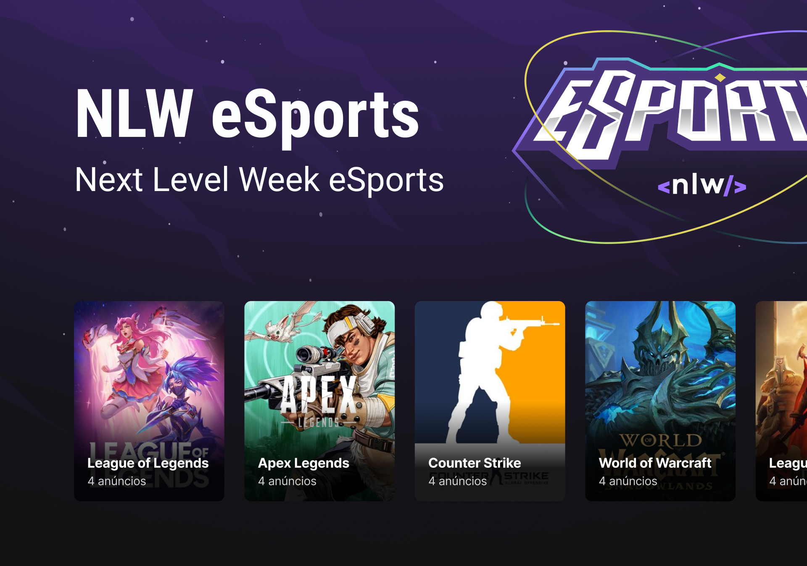
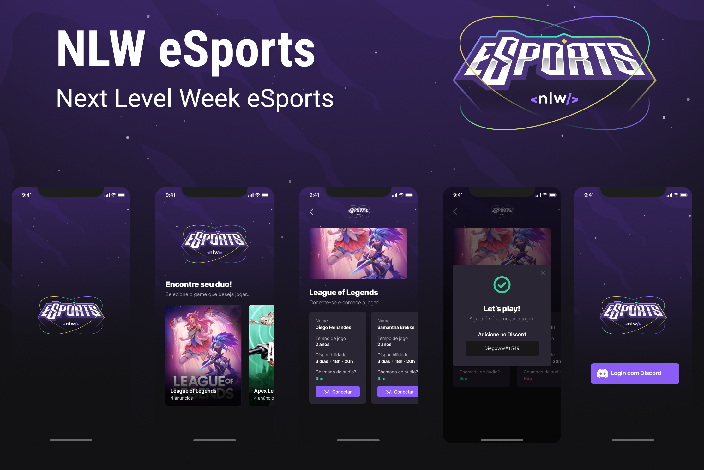

# :iphone: Nlw eSports
<p>Web</p>
<div align="center">
    
</div>
<br />
<p>Mobile</p>
<div align="center">
    
</div>

---

## :bookmark_tabs: Sobre

- O Nlw eSports, foi um evento da [Rocketseat](https://www.rocketseat.com.br/), onde os desenvolvedores criaram o Backend, Frontend e um App Mobile, de uma plataforma de conexão entre jogadores. Este Monorepo engloba esses três projetos, onde ao clicar em um deles, é possível ver o projeto e principalmente as melhorias feitas após o evento.

---

## :art: Layout

- [Figma](https://www.figma.com/community/file/1150897317533332617)

---

## :gear: Techs

- [React Native](https://reactnative.dev/)
- [Expo](https://expo.dev/)
- [React](https://reactjs.org)
- [Radix UI](https://www.radix-ui.com/)
- [Tailwind CSS](https://tailwindcss.com/)
- [Express](https://expressjs.com/)
- [Prisma](https://www.prisma.io/)
- [Typescript](https://www.typescriptlang.org/)

---

## :desktop_computer: Como usar

<p><strong> 1º</strong> Ao baixar o monorepo, você poderá excutar os seguintes projetos: Backend, Frontend ou Mobile
</p>

<p><strong> 2º</strong> Depois de escolhido,  basta ir no terminal e usar o comando cd, para navegar entre as pastas, por exemplo:</p>
```
    cd server
```
<p><strong> 3º</strong> Depois disso, instalar as dependências: </p>

```
    yarn install
```

<p> E rodar o projeto:<p>

<center>
    Frontend e Backend
</center>

```
    yarn dev
```

<center>
    Mobile
</center>

```
    expo start
```

<p><strong> Obs: Para executar o Frontend e o Mobile é necessário o Backend(server) estar rodando para receber as requisições </strong></p>

---

## :books: License

Arquivos sob a licença [MIT](https://github.com/lucasgomesgp) criado por Lucas Gomes.
