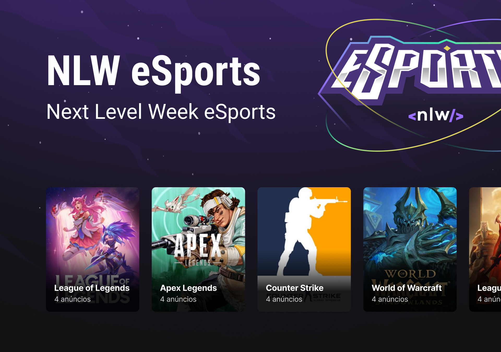
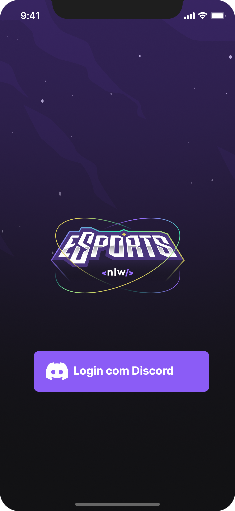

# :iphone: Nlw eSports

<div align="center">
    
</div>

---

## :bookmark_tabs: Sobre

- O Nlw eSports - Mobile, criado no evento da [Rocketseat](https://www.rocketseat.com.br/), trata-se de um App, com o intuíto de conectar jogadores, através dos anúncios publicados no servidor. Dessa forma o aplicativo funciona como um intermediador entre os jogadores, facilitando a reunião para jogar.

---

## :art: Layout

- [Figma](https://www.figma.com/community/file/1150897317533332617)

---

## :gear: Techs

- [React Native](https://reactnative.dev/)
- [Expo](https://expo.dev/)
- [Typescript] (https://www.typescriptlang.org/)
- [React Navigation](https://reactnavigation.org/)
- [Discord API](https://discord.com/developers/docs/reference)
---

## :book: Features adicionais

- Login com Discord
- Armazenamento offline das informações de login
- Gerenciamento de estado global com a Context API

<div align="center">
    
</div>

---
## :desktop_computer: Como usar
<p>Para o projeto funcionar é necessário que o Backend criado esteja rodando!</p>

<br />

<p> Instalação das dependências: </p>

```
    yarn install
```

Para rodar o aplicativo é necessário a utilização do [Emulador](https://developer.android.com/studio), por isso o passo abaixo necessita que ele esteja aberto e que o [Expo-CLI](https://docs.expo.dev/workflow/expo-cli/) esteja instalado na sua máquina. Após tudo isso executar o comando abaixo:

```
    expo start
```

---

## :books: License

Arquivos sob a licença [MIT](https://github.com/lucasgomesgp) criado por Lucas Gomes.